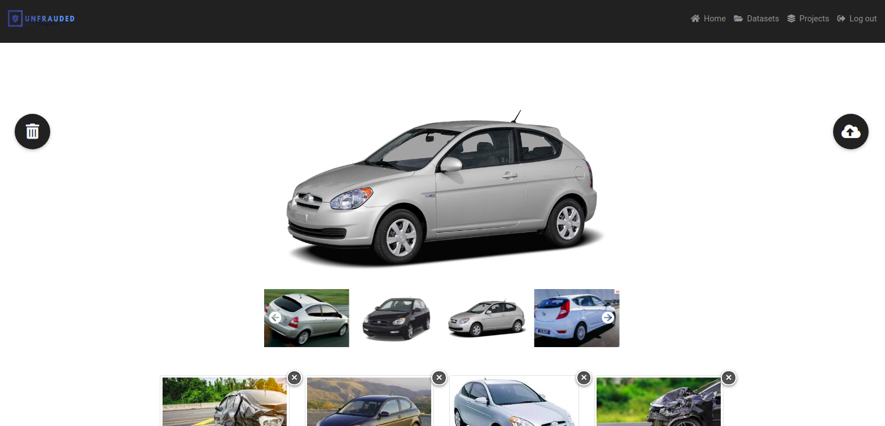

<h1 align="center" style="color :black">
  <a href="https://www.wish.com/">
     Data Labeling Tool 

  </a>
</h1>

# 📋 Introduction 

 as Part of my internship at Unfrauded startup i built a data labeling tool using MEAN-STACK technologies and Rest API for the deep learning mmodel Dextr Module ( Deep extreme Cut which is a image segmentation model ) using flask and i finished this task by generating docker images for each side of application (take a look to my dockerhub account :https://hub.docker.com/repository/docker/hamdirhibi) and deploy them to AWS using ECS orchestrator 

 

  
  
  
  
  
  
  
  
  

# 🎉 Technologies used 

- Angular 8+
- NodeJS
- Express 
- MongoDB
- Flask
- Python 3.7
- Dextr Model ( image segmentation model ) 
- Conda . 
- AWS ( ECS , EC2 , S3 ... ) 
- Docker 

# 📋 Requirements 

- Npm (node packages manager : https://phoenixnap.com/kb/install-node-js-npm-on-windows) 

- Node JS (https://www.geeksforgeeks.org/installation-of-node-js-on-linux/ ) 

- Angular CLI (https://www.codingforentrepreneurs.com/blog/angular-setup-guide) 

- IONIC CLI (https://tecadmin.net/install-ionic-framework-on-ubuntu/) 

- Git  (https://www.atlassian.com/git/tutorials/install-git) 

- Python 3.7  .

- Conda 3.

- Docker .

- AWS account include ( EC2,  S3 , ECS )   

# 📖 Run The Project

- First open your terminal and clone the project in your PC using : https://github.com/hamdirhibi/Data-labeling-Project.git

- now you have to clone each application part repository . 

- RUN cd DATA-LABELING-BACK-END && npm install 

- Create new .env file and pass the following variables : 
  
  MONGODB_URI ==> the url of you mongodb databse (if you don't have yet go to https://account.mongodb.com/ and create one ! ) 
  
  PORT = 3000
  
  TOKEN_SECRET=chose_your_secrect_key_for_jwt
  
  AWS_ACCESS_KEY  = Your access key 

  AWS_SECRET_ACCESS_KEY = your secret key 

  AWS_BUCKET_NAME = datasets-uploads
  
  AWS_REGION = your aws region 
  
- save the change and run the back-end by passing : npm start 

  

 

- thats awesome ! lets move to the Front-end  config now ! 

- cd DATA-LABELING-FRONT-END && npm install 

-ng serve

  

 

- cd .. 

- cd Rest-API-for-Dextr-Model-Deep-Extreme-Cut-Deep-Learning 

- pip install -r requirements.txt

- python main.py

  

 

Wow that's  super simple ? 

## 🚀 Test It ? 

that's it ? of course not , here you will find ec2 instance link    : 

you can use the test account to test app features  : 

email : geekrhibi@gmail.com
password: hamdirhibi

##  Contact Me

don't hesitate to contact me if there any problem or suggestion :
- e-mail : geekrhibi@gmail.com
- linkedin : hamdirhibi
- telegram : 3ezdine junior

